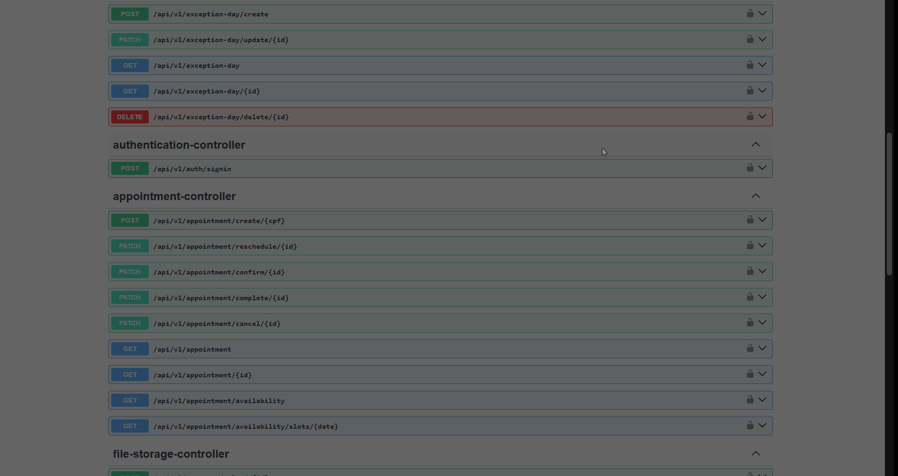

# Clinica Api

Projeto pessoal que utilizei para aprender Java e seu framework Spring Boot. Uma API REST desenvolvida para a gestão de uma clínica psiquiátrica com diversas funcionalidades, métodos de segurança e hierarquia de usuários. 

## Funcionamento e documentação da api via Swagger
__Demonstração do funcionamento do token / Tratamento de excessão / Endpoint de disponibilidade__

__Demonstração de todos endpoints e schemas pelo Swagger__

## Tecnologias e implementações
* __FRAMEWORK E LINGUAGEM:__ Java 17 e Spring Boot 3
* __FUNCIONALIDADES DO JAVA E SPRING__: Specification, Mapper, Record, Enum, IOC e Beans
* __BOAS PRÁTICAS DE DESENVOLVIMENTO:__ DTO e DAO, Teste unitário, Desacoplamento de responsabilidades, Foco em escalabilidade e Desenvolvimento em camadas
* __SEGURANÇA:__ JWT token, Spring Security e Bcrypt
* __BANCO DE DADOS:__ MySql, JDBC, JPA e Hibernate
* __BIBLIOTECAS:__ Lombok, MapStruct, Apache PdfBox
* __DOCUMENTAÇÃO:__ Swagger

## Principais Funcionalidades
* __AUTORIZAÇÃO E AUTENTICAÇÃO VIA TOKEN COM NÍVEIS DE ACESSO__
* __SLOTS DE AGENDAMENTOS E MOTORES DE BUSCA PARA PACIENTES E CONSULTAS__
* __CRIPTOGRAFIA E TRATAMENTO DE PDFs CONTENDO ANAMNESE__
* __DISPONIBILIDADE DO DIA BASEADO NA QUANTIDADE DE CONSULTAS E EXCESSÕES DE DIAS (EX: FERIADO)__

## Destaques Técnicos
* __CÁLCULO DE HORÁRIO E DISPONIBILIDADE DE DIA__
* __TRATAMENTO GLOBAL DE ERROS__
* __FLUXO DE FILTROS E SEGURANÇA DOS ENDPOINTS__
